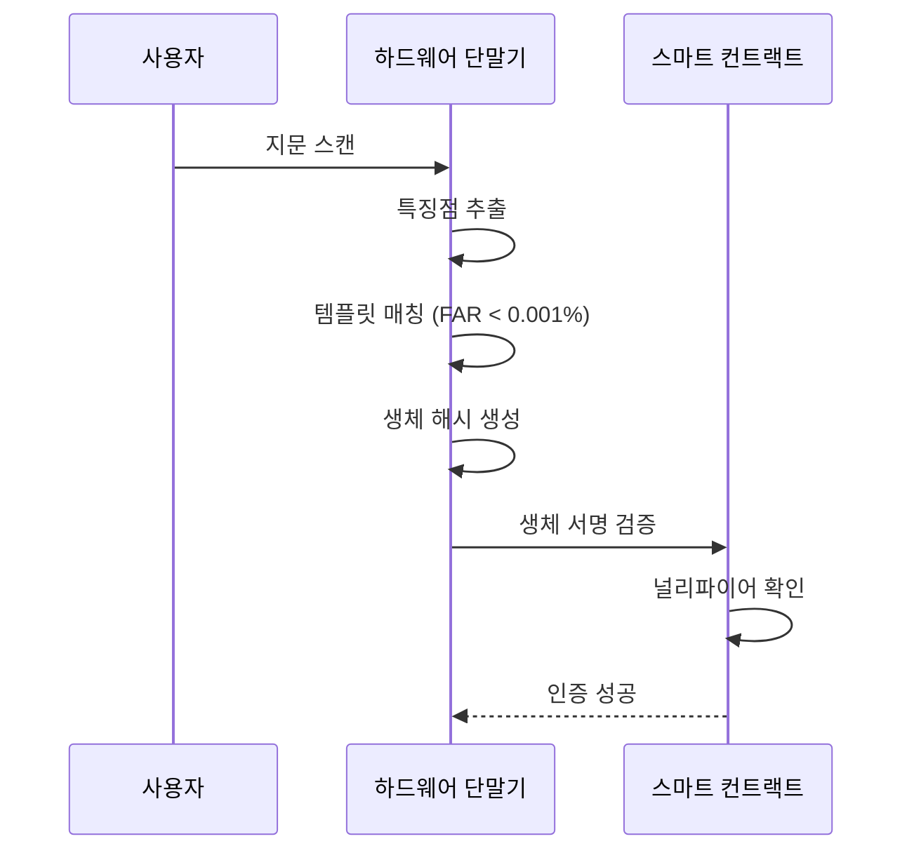
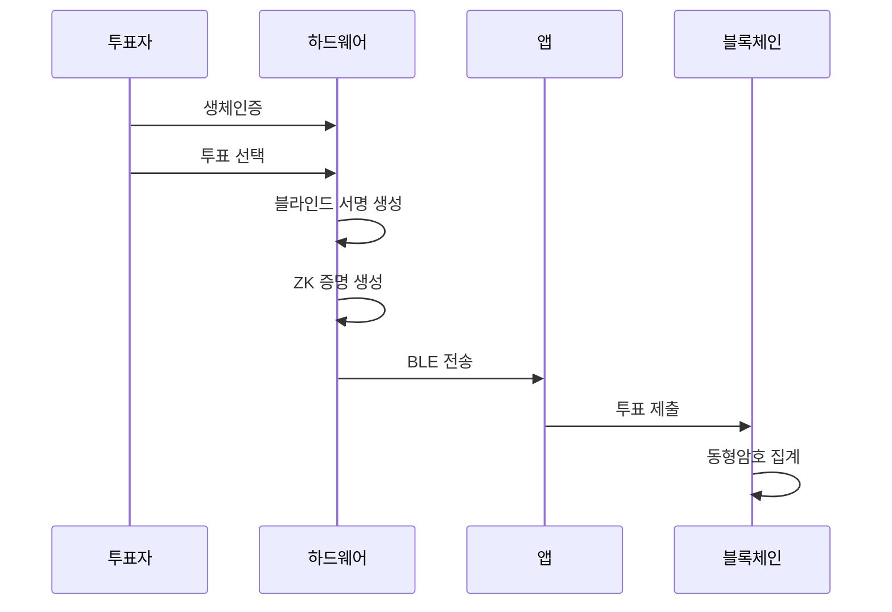

# Security Architecture

## 보안 아키텍처 개요

본 시스템은 2024년 최신 보안 기술을 적용한 생체인증 기반 DAO 투표 시스템입니다.

## 🛡️ 다층 보안 구조

### 1. 하드웨어 보안 계층 (Hardware Security Layer)

#### 생체인증 보안
- **지문 센서**: 정전식 508 DPI 고해상도 센서
- **특징점 추출**: 융선 패턴, 분기점, 끝점 분석
- **FAR**: 0.001% 이하 (오인식률)
- **FRR**: 1% 이하 (거부율)
- **템플릿 암호화**: AES-256으로 생체 데이터 보호

#### 물리적 보안
- **전도성 메시**: 케이스 전체 침입 감지
- **환경 센서**: 전압, 온도, 주파수 이상 감지
- **데이터 소거**: 침입 시 10μs 이내 자동 소거
- **TPM/HSM**: 하드웨어 보안 모듈 통합

#### ECDSA 암호화 모듈
- **곡선**: NIST P-256 (HSM 호환성)
- **키 길이**: 256비트
- **하드웨어 가속**: 전용 암호화 칩
- **사이드채널 방지**: 전력 패턴 마스킹

### 2. 암호학적 보안 계층 (Cryptographic Security Layer)

#### 영지식 증명 (Zero-Knowledge Proofs)
- **프로토콜**: Groth16 zk-SNARKs
- **곡선**: BN128
- **신뢰 설정**: 의식적 파라미터 생성
- **증명 크기**: ~200바이트
- **검증 시간**: <10ms

#### 동형암호 (Homomorphic Encryption)
- **알고리즘**: Paillier 암호화
- **키 길이**: 2048비트 (생산환경)
- **실시간 집계**: 멕시코 연방선거 2024 패턴
- **임계값 복호화**: 분산 키 관리

#### 블라인드 서명 (Blind Signatures)
- **기반**: ECDSA 블라인드 서명
- **블라인딩**: 타원곡선 기반
- **익명성**: 완전한 투표 비밀성
- **검증**: 하드웨어 레벨 서명 검증

### 3. 네트워크 보안 계층 (Network Security Layer)

#### BLE 통신 보안
- **LE Secure Connections**: Bluetooth 5+ 표준
- **ECDH 키 교환**: P-256 곡선
- **AES-256 암호화**: 세션 암호화
- **중계 공격 방지**: 근접성 검증
- **SweynTooth 방지**: 알려진 취약점 패치

#### 블록체인 통신
- **TLS 1.3**: 최신 전송 계층 보안
- **서명 검증**: 모든 트랜잭션 서명 확인
- **논스 관리**: 재전송 공격 방지
- **가스 최적화**: DoS 공격 방지

### 4. 애플리케이션 보안 계층 (Application Security Layer)

#### 스마트 컨트랙트 보안
- **재진입 방지**: ReentrancyGuard 적용
- **접근 제어**: Role-based 권한 관리
- **오버플로우 방지**: SafeMath 라이브러리
- **업그레이드 가능**: 프록시 패턴

#### 백엔드 API 보안
- **JWT 인증**: 토큰 기반 인증
- **속도 제한**: 사용자당 분당 10요청
- **입력 검증**: Joi 스키마 검증
- **SQL 인젝션 방지**: 매개변수화 쿼리

## 🔒 보안 위협 모델

### 공격 벡터 분석

#### 1. 물리적 공격
- **위협**: 하드웨어 해체, 사이드채널 공격
- **대응**: 전도성 메시, 환경 센서, 데이터 소거
- **복구**: 불가능 (데이터 완전 파괴)

#### 2. 네트워크 공격  
- **위협**: 중간자 공격, BLE 스니핑
- **대응**: LE Secure Connections, 상호 인증
- **모니터링**: 실시간 연결 상태 감시

#### 3. 암호학적 공격
- **위협**: 키 복구, 서명 위조
- **대응**: HSM 기반 키 관리, 하드웨어 서명
- **업데이트**: 정기적 암호학적 파라미터 갱신

#### 4. 소프트웨어 공격
- **위협**: 재진입, 오버플로우, 권한 상승
- **대응**: 정적 분석, 퍼징, 코드 감사
- **모니터링**: 실시간 이상 행동 탐지

## 🛠️ 보안 구현 세부사항

### 생체인증 프로세스

### 투표 프로세스

## 📊 보안 성능 지표

### 암호화 성능
- **ECDSA 서명**: <50ms (하드웨어)
- **ZK 증명 생성**: <500ms
- **ZK 증명 검증**: <10ms
- **동형암호 연산**: <100ms

### 보안 강도
- **생체인증**: 2^-30 (FAR)
- **ECDSA**: 2^128 비트 보안
- **AES-256**: 2^256 비트 보안
- **해시**: 2^256 비트 보안

### 가용성
- **업타임**: 99.9%
- **복구 시간**: <1분
- **백업**: 실시간 복제
- **재해 복구**: <24시간

## 🔍 보안 감사

### 정기 감사 항목
1. **코드 감사**: 분기별 전체 코드베이스 검토
2. **침투 테스트**: 월별 외부 보안 테스트
3. **취약점 스캔**: 주별 자동화 스캔
4. **설정 검토**: 월별 보안 설정 점검

### 컴플라이언스
- **GDPR**: 개인정보 보호
- **SOC 2**: 보안 제어
- **ISO 27001**: 정보보안 관리
- **FIPS 140-2**: 암호화 모듈

## 🚨 사고 대응

### 보안 사고 분류
- **Level 1**: 의심스러운 활동
- **Level 2**: 보안 위반 확인
- **Level 3**: 데이터 유출
- **Level 4**: 시스템 침해

### 대응 절차
1. **탐지**: 자동화 모니터링
2. **격리**: 영향 범위 제한
3. **분석**: 근본 원인 분석
4. **복구**: 시스템 정상화
5. **개선**: 재발 방지 조치

### 연락처
- **보안팀**: security@biometric-dao.org
- **긴급 대응**: +82-2-1234-5678
- **취약점 신고**: security-report@biometric-dao.org

## 📚 참고 자료

### 표준 및 규격
- [NIST SP 800-63B](https://pages.nist.gov/800-63-3/sp800-63b.html) - 디지털 신원 인증
- [ISO/IEC 24745](https://www.iso.org/standard/52946.html) - 생체인증 보안
- [RFC 8702](https://tools.ietf.org/rfc/rfc8702.txt) - zk-SNARKs 보안

### 연구 논문
- "Transforming online voting: blockchain and biometric verification" (2024)
- "Overcoming Bottlenecks in Homomorphic Encryption for 2024 Mexican Federal Election"
- "BLE Security Vulnerabilities and Countermeasures" (2024)

---

**⚠️ 주의사항**: 이 시스템은 방어적 보안 목적으로만 사용해야 하며, 악의적인 용도로 사용을 금지합니다.